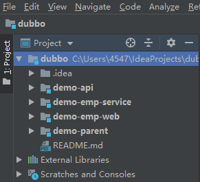
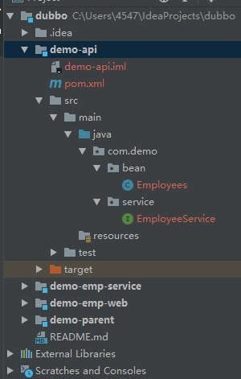
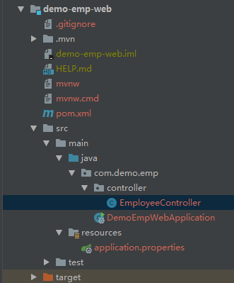
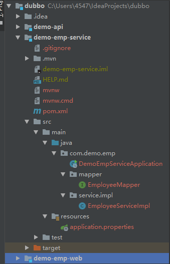
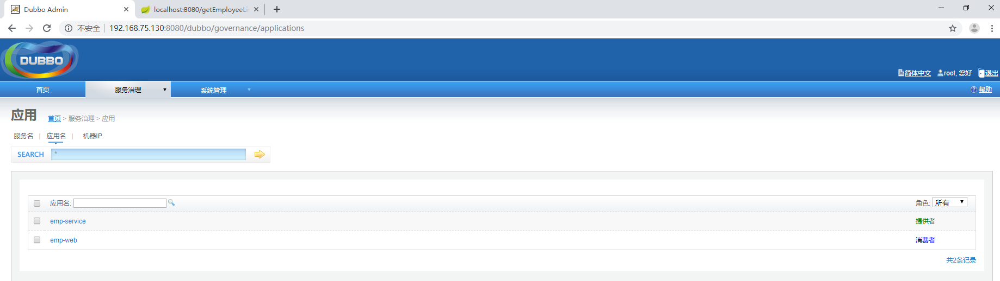
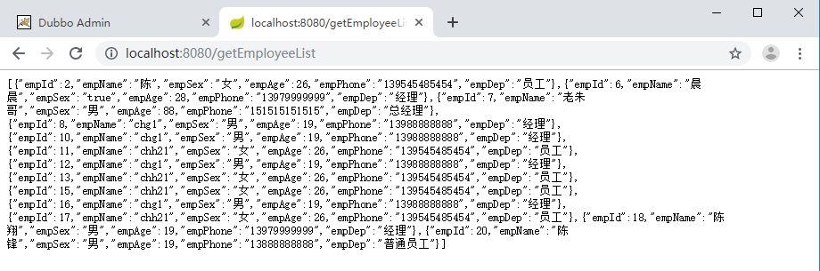

# Spring Boot + Dubbo实践

## 概述

​		使用Spring Boot + Dubbo + zookeeper搭建一个简单的分布式服务。

> Dubbo是阿里巴巴开源的基于 Java 的高性能 RPC（一种远程调用） 分布式服务框架（SOA），致力于提供高性能和透明化的RPC远程服务调用方案，以及SOA服务治理方案。

## 项目搭建



### demo-parent

maven项目，主要用于统一项目版本依赖。

> pom.xml

```xml
<?xml version="1.0" encoding="UTF-8"?>
<project xmlns="http://maven.apache.org/POM/4.0.0"
         xmlns:xsi="http://www.w3.org/2001/XMLSchema-instance"
         xsi:schemaLocation="http://maven.apache.org/POM/4.0.0 http://maven.apache.org/xsd/maven-4.0.0.xsd">
    <modelVersion>4.0.0</modelVersion>

    <groupId>com.demo</groupId>
    <artifactId>demo-parent</artifactId>
    <version>1.0-SNAPSHOT</version>
    <packaging>pom</packaging>
    <parent>
        <groupId>org.springframework.boot</groupId>
        <artifactId>spring-boot-starter-parent</artifactId>
        <version>2.1.5.RELEASE</version>
        <relativePath/>
    </parent>
    <properties>
        <project.build.sourceEncoding>UTF-8</project.build.sourceEncoding>
        <project.reporting.outputEncoding>UTF-8</project.reporting.outputEncoding>
        <java.version>1.8</java.version>
        <fastjson.version>1.2.8</fastjson.version>
        <dubbo-starter.version>1.1.3</dubbo-starter.version>
        <dubbo.version>2.6.6</dubbo.version>
        <zkclient.version>0.10</zkclient.version>
        <mybatis.version>2.1.0</mybatis.version>
        <nekohtml.version>1.9.20</nekohtml.version>
        <xml-apis.version>1.4.01</xml-apis.version>
        <batik-ext.version>1.9.1</batik-ext.version>
        <jsoup.version>1.11.2</jsoup.version>
        <httpclient.version>4.5.5</httpclient.version>
        <commons-lang3.version>3.7</commons-lang3.version>
        <mapper-starter.version>2.1.0</mapper-starter.version>
        <jedis.version>2.9.0</jedis.version>
        <jest.version>5.3.3</jest.version>
        <jna.version>4.5.1</jna.version>
        <beanUtils.version>1.9.3</beanUtils.version>
    </properties>
    <dependencyManagement>
        <dependencies>
            <dependency>
                <groupId>com.alibaba</groupId>
                <artifactId>fastjson</artifactId>
                <version>${fastjson.version}</version>
            </dependency>
            <dependency>
                <groupId>com.alibaba</groupId>
                <artifactId>dubbo</artifactId>
                <version>${dubbo.version}</version>
            </dependency>

            <dependency>
                <groupId>com.alibaba</groupId>
                <artifactId>dubbo</artifactId>
                <version>${dubbo.version}</version>
            </dependency>

            <dependency>
                <groupId>com.101tec</groupId>
                <artifactId>zkclient</artifactId>
                <version>${zkclient.version}</version>
            </dependency>

            <dependency>
                <groupId>com.gitee.reger</groupId>
                <artifactId>spring-boot-starter-dubbo</artifactId>
                <version>${dubbo-starter.version}</version>
            </dependency>

            <dependency>
                <groupId>org.mybatis.spring.boot</groupId>
                <artifactId>mybatis-spring-boot-starter</artifactId>
                <version>${mybatis.version}</version>
            </dependency>
            <dependency>
                <groupId>net.sourceforge.nekohtml</groupId>
                <artifactId>nekohtml</artifactId>
                <version>${nekohtml.version}</version>
            </dependency>

            <dependency>
                <groupId>xml-apis</groupId>
                <artifactId>xml-apis</artifactId>
                <version>${xml-apis.version}</version>
            </dependency>

            <dependency>
                <groupId>org.apache.xmlgraphics</groupId>
                <artifactId>batik-ext</artifactId>
                <version>${batik-ext.version}</version>
            </dependency>

            <!-- https://mvnrepository.com/artifact/org.jsoup/jsoup -->
            <dependency>
                <groupId>org.jsoup</groupId>
                <artifactId>jsoup</artifactId>
                <version>${jsoup.version}</version>
            </dependency>
            <dependency>
                <groupId>tk.mybatis</groupId>
                <artifactId>mapper-spring-boot-starter</artifactId>
                <version>${mapper-starter.version}</version>
            </dependency>
            <dependency>
                <groupId>commons-beanutils</groupId>
                <artifactId>commons-beanutils</artifactId>
                <version>${beanUtils.version}</version>
            </dependency>
        </dependencies>
    </dependencyManagement>
</project>
```

### demo-api

maven项目，用于存放bean和service。



> Employee.java

```java
package com.demo.bean;

import javax.persistence.Id;
import java.io.Serializable;

public class Employees implements Serializable {
    @Id
    private Integer empId;
    private String empName;
    private String empSex;
    private Integer empAge;
    private String empPhone;
    private String empDep;
	//getter and setter
}

```

> EmployeeService

```java
package com.demo.service;

import com.demo.bean.Employees;

import java.util.List;

public interface EmployeeService {
    List<Employees> getEmployeeList();
}
```

> pom.xml

```java
<?xml version="1.0" encoding="UTF-8"?>
<project xmlns="http://maven.apache.org/POM/4.0.0"
         xmlns:xsi="http://www.w3.org/2001/XMLSchema-instance"
         xsi:schemaLocation="http://maven.apache.org/POM/4.0.0 http://maven.apache.org/xsd/maven-4.0.0.xsd">
    <modelVersion>4.0.0</modelVersion>

    <groupId>com.demo</groupId>
    <artifactId>demo-api</artifactId>
    <version>1.0-SNAPSHOT</version>
    <dependencies>
        <dependency>
            <groupId>tk.mybatis</groupId>
            <artifactId>mapper-spring-boot-starter</artifactId>
            <version>2.1.0</version><!-- 2.1.0-->
            <exclusions>
                <exclusion>
                    <groupId>org.springframework.boot</groupId>
                    <artifactId>spring-boot-starter-jdbc</artifactId>
                </exclusion>
            </exclusions>
        </dependency>
    </dependencies>
</project>
```

### demo-emp-web

Spring Boot 项目，主要有Controller，调用Service，作为消费者。



> EmployeeController.java

```java
package com.demo.emp.controller;

import com.alibaba.dubbo.config.annotation.Reference;
import com.demo.bean.Employees;
import com.demo.service.EmployeeService;
import org.springframework.stereotype.Controller;
import org.springframework.web.bind.annotation.RequestMapping;
import org.springframework.web.bind.annotation.ResponseBody;

import java.util.List;

@Controller
public class EmployeeController {
    @Reference
    private EmployeeService employeeService;

    @RequestMapping("getEmployeeList")
    @ResponseBody
    public List<Employees> getEmployeeList(){
        List<Employees> employeesList = employeeService.getEmployeeList();
        return employeesList;
    }
}

```

注意，`EmployeeService`这里用的不是自动装配注解，而是用的`@Reference`注解。

> pom.xml

```xml
<?xml version="1.0" encoding="UTF-8"?>
<project xmlns="http://maven.apache.org/POM/4.0.0" xmlns:xsi="http://www.w3.org/2001/XMLSchema-instance"
         xsi:schemaLocation="http://maven.apache.org/POM/4.0.0 https://maven.apache.org/xsd/maven-4.0.0.xsd">
    <modelVersion>4.0.0</modelVersion>
    <parent>
        <groupId>com.demo</groupId>
        <artifactId>demo-parent</artifactId>
        <version>1.0-SNAPSHOT</version>
        <relativePath/> <!-- lookup parent from repository -->
    </parent>
    <groupId>com.demo</groupId>
    <artifactId>demo-emp-web</artifactId>
    <version>0.0.1-SNAPSHOT</version>
    <name>demo-emp-web</name>
    <description>Demo project for Spring Boot</description>

    <properties>
        <java.version>1.8</java.version>
    </properties>

    <dependencies>
        <dependency>
            <groupId>com.demo</groupId>
            <artifactId>demo-api</artifactId>
            <version>1.0-SNAPSHOT</version>
        </dependency>
        <dependency>
            <groupId>com.alibaba</groupId>
            <artifactId>fastjson</artifactId>
        </dependency>
        <dependency>
            <groupId>org.springframework.boot</groupId>
            <artifactId>spring-boot-starter-test</artifactId>
        </dependency>

        <dependency>
            <groupId>org.springframework.boot</groupId>
            <artifactId>spring-boot-starter-web</artifactId>
        </dependency>

        <dependency>
            <groupId>org.apache.httpcomponents</groupId>
            <artifactId>httpclient</artifactId>
        </dependency>

        <dependency>
            <groupId>org.apache.commons</groupId>
            <artifactId>commons-lang3</artifactId>
        </dependency>

        <dependency>
            <groupId>commons-beanutils</groupId>
            <artifactId>commons-beanutils</artifactId>
        </dependency>

        <dependency>
            <groupId>commons-codec</groupId>
            <artifactId>commons-codec</artifactId>
        </dependency>
        <dependency>
            <groupId>com.alibaba</groupId>
            <artifactId>dubbo</artifactId>
        </dependency>
        <dependency>
            <groupId>com.101tec</groupId>
            <artifactId>zkclient</artifactId>
            <exclusions>
                <exclusion>
                    <groupId>org.slf4j</groupId>
                    <artifactId>slf4j-log4j12</artifactId>
                </exclusion>
            </exclusions>
        </dependency>
        <dependency>
            <groupId>com.gitee.reger</groupId>
            <artifactId>spring-boot-starter-dubbo</artifactId>
            <exclusions>
                <exclusion>
                    <groupId>com.alibaba</groupId>
                    <artifactId>dubbo</artifactId>
                </exclusion>
            </exclusions>
        </dependency>
    </dependencies>

    <build>
        <plugins>
            <plugin>
                <groupId>org.springframework.boot</groupId>
                <artifactId>spring-boot-maven-plugin</artifactId>
            </plugin>
        </plugins>
    </build>
</project>

```

> application.properties

```properties
logging.level.root = info
#dubbo配置
server.port=8080
#dubbo 服务名称
spring.dubbo.application=emp-web
#通讯协议名称
spring.dubbo.protocol.name=dubbo
spring.dubbo.protocol.port=20880
#zookeeper注册中心地址
spring.dubbo.registry.address=zookeeper://192.168.75.130:2181
#zookeeper的通讯协议名称
spring.dubbo.registry.protocol=zookeeper
#dubbo服务扫描路径
spring.dubbo.base-package=com.demo
#设置超时时间
#spring.dubbo.consumer.timeout=
#设置检查服务是否存在
spring.dubbo.consumer.check=false
```

​		Web里面不需要配置数据库连接等属性。

### demo-emp-service

Spring Boot项目，里面有`mapper`和`service`的实现类，服务提供者。



> EmployeeServiceImpl.java

```java
package com.demo.emp.service.impl;

import com.alibaba.dubbo.config.annotation.Service;
import com.demo.bean.Employees;
import com.demo.emp.mapper.EmployeeMapper;
import com.demo.service.EmployeeService;
import org.springframework.beans.factory.annotation.Autowired;

import java.util.List;
@Service
public class EmployeeServiceImpl implements EmployeeService {

    @Autowired
    private EmployeeMapper employeeMapper;

    @Override
    public List<Employees> getEmployeeList() {
        return employeeMapper.selectAll();
    }
}
```

`@Service`注解用的为`com.alibaba.dubbo.config.annotation.Service`。

> EmployeeMapper.java

```java
package com.demo.emp.mapper;

import com.demo.bean.Employees;
import tk.mybatis.mapper.common.Mapper;
@org.apache.ibatis.annotations.Mapper
public interface EmployeeMapper extends Mapper<Employees> {
}

```

使用通用Mapper，通用Mapper可以通过Mybatis的拦截器原理，动态的帮我们实现单表的增删改查功能，大大降低了我们的开发成本，减少了我们的工作量。

> application.properties.java

```java
server.port=8070
mybatis.mapper-locations=classpath:mapper/*.xml
mybatis.configuration.map-underscore-to-camel-case=true
spring.datasource.url=jdbc:mysql:///xxx
spring.datasource.driver-class-name=com.mysql.cj.jdbc.Driver
spring.datasource.username=root
spring.datasource.password=xxx
logging.level.root = info
#dubbo 服务名称
spring.dubbo.application=emp-service
#通讯协议名称
spring.dubbo.protocol.name=dubbo
spring.dubbo.protocol.port=20880
#zookeeper注册中心地址
spring.dubbo.registry.address=zookeeper://192.168.75.130:2181
#zookeeper的通讯协议名称
spring.dubbo.registry.protocol=zookeeper
#dubbo服务扫描路径
spring.dubbo.base-package=com.demo

```

## 测试

### dubbo-admin



### Web调用Service



