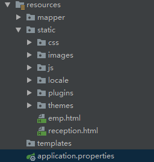
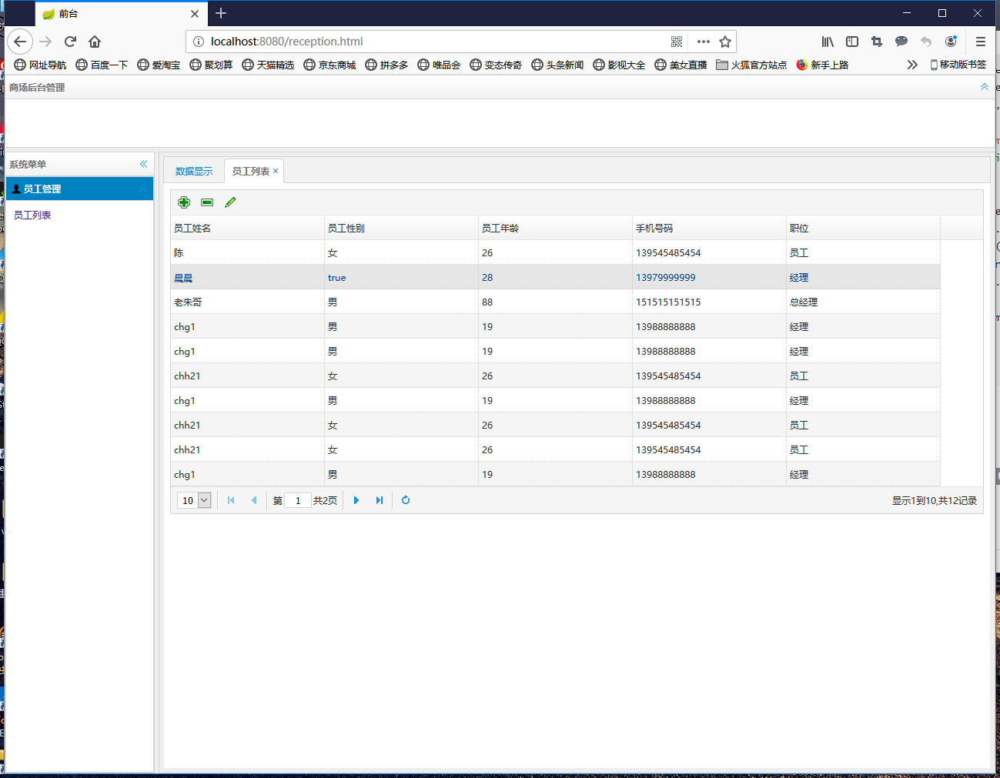
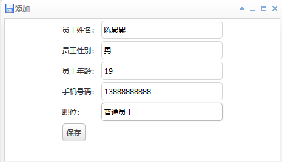
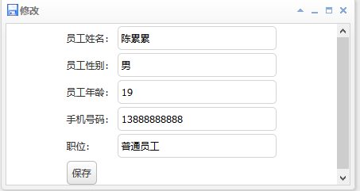
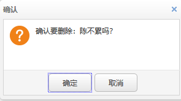
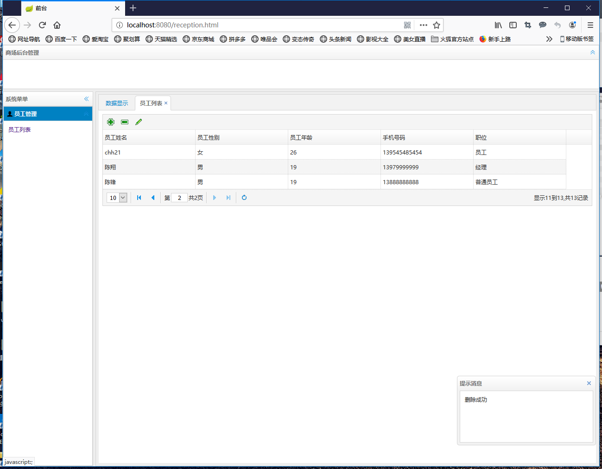

## Spring Boot+MyBatis+EasyUI实践

### 概述

Spring Boot+MyBatis+EasyUI 实现简单的后台管理系统，基本的增删改查，通过EasyUI发送ajax请求，后台返回json数据。

### 项目搭建

新建Spring Boot工程

`pom.xml`中添加MyBatis和MySq依赖

```xml
        <dependency>
            <groupId>org.mybatis.spring.boot</groupId>
            <artifactId>mybatis-spring-boot-starter</artifactId>
            <version>2.0.1</version>
        </dependency>

        <dependency>
            <groupId>mysql</groupId>
            <artifactId>mysql-connector-java</artifactId>
            <scope>runtime</scope>
        </dependency>
```

复制EasyUI需要的静态文件到static中。



配置`application.properties`

```properties
mybatis.type-aliases-package=com.web.easyui.entity
mybatis.mapper-locations=classpath:mapper/*.xml
mybatis.configuration.map-underscore-to-camel-case=true
spring.datasource.url=jdbc:mysql:///hotel?characterEncoding=UTF8&serverTimezone=UTC&userSSL=false
spring.datasource.driver-class-name=com.mysql.cj.jdbc.Driver
spring.datasource.username=root
spring.datasource.password=
```

### 建立实体类Employee

```java
public class Employee {
    private Long emp_id;
    private String emp_name;
    private String emp_sex;
    private Integer emp_age;
    private String emp_phone;
    private String emp_dep;
	//... getter setter  constructor
}
```

### Mybatis接口和映射

EmployeeMapper.xml映射文件

```xml
<?xml version="1.0" encoding="UTF-8" ?>
<!DOCTYPE mapper PUBLIC "-//mybatis.org//DTD Mapper 3.0//EN" "http://mybatis.org/dtd/mybatis-3-mapper.dtd" >
<mapper namespace="com.web.easyui.mapper.EmployeeMapper">

    <resultMap id="employeeMap" type="com.web.easyui.entity.Employee">
        <id property="emp_id" column="emp_id" javaType="java.lang.Long"></id>
        <result property="emp_name" column="emp_name" javaType="java.lang.String"></result>
        <result property="emp_sex" column="emp_sex" javaType="java.lang.String"></result>
        <result property="emp_age" column="emp_age" javaType="java.lang.Integer"></result>
        <result property="emp_phone" column="emp_phone" javaType="java.lang.String"></result>
        <result property="emp_dep" column="emp_dep" javaType="java.lang.String"></result>
    </resultMap>

    <select id="getAllEmployee" resultMap="employeeMap">
        select * from employees
    </select>

    <select id="getTotalCount" resultType="java.lang.Integer">
        select count(*) from employees
    </select>

    <select id="findByPage" resultMap="employeeMap">
        select * from employees limit #{start},#{rows}
    </select>

    <select id="findById" resultMap="employeeMap" parameterType="java.lang.Long">
        select * from employees where emp_id = #{emp_id}
    </select>

    <insert id="addEmployee" parameterType="com.web.easyui.entity.Employee">
        insert into employees ( emp_id, emp_name, emp_sex, emp_age, emp_phone, emp_dep )
        values ( #{emp_id}, #{emp_name}, #{emp_sex}, #{emp_age}, #{emp_phone}, #{emp_dep} )
    </insert>

    <delete id="deleteEmployee" parameterType="com.web.easyui.entity.Employee">
        delete from employees where emp_id = #{emp_id}
    </delete>
    <update id="updateEmployee" parameterType="com.web.easyui.entity.Employee">
        update employees SET emp_id=#{emp_id},emp_name=#{emp_name},emp_sex= #{emp_sex},
        emp_age=#{emp_age},emp_phone= #{emp_phone},  emp_dep=#{emp_dep}
        where emp_id=#{emp_id}
    </update>
</mapper>
```

EmployeeMapper.java

```java
public interface EmployeeMapper {
    List<Employee> getAllEmployee();
    void addEmployee(Employee employee);
    void deleteEmployee(Employee employee);
    int getTotalCount();
    List<Employee> findByPage(int start,int rows);
    Employee findById(Long emp_id);
    void updateEmployee(Employee employee);
}
```

### Service实现

EmployeeServiceImpl.java

```java
@Service
@Primary
public class EmployeeServiceImpl implements EmployeeService {
    @Autowired
    private EmployeeMapper employeeMapper;

    @Override
    public List<Employee> getAllEmployee() {
        return employeeMapper.getAllEmployee();
    }

    @Override
    public List<Employee> findByPage(int start, int rows) {
        return employeeMapper.findByPage(start,rows);
    }

    @Override
    public Employee findById(Long emp_id) {
        return employeeMapper.findById(emp_id);
    }

    @Override
    public void updateEmployee(Employee employee) {
        employeeMapper.updateEmployee(employee);
    }

    @Override
    public int getTotalCount() {
        return employeeMapper.getTotalCount();
    }

    @Override
    public void addEmployee(Employee employee) {
        employeeMapper.addEmployee(employee);
    }

    @Override
    public void deleteEmployee(Employee employee) {
        employeeMapper.deleteEmployee(employee);
    }
}

```

### Controller实现

```java
@RestController
public class EmployeeController {
    @Autowired
    private EmployeeService employeeService;

    @RequestMapping(value = "/getEmployee",method = RequestMethod.GET)
    public List<Employee> getAllEmployee(){
        return employeeService.getAllEmployee();
    }

    @RequestMapping(value = "/findByPage",method = RequestMethod.POST)
    public Map findByPage(HttpServletRequest request){
        int page = Integer.parseInt(request.getParameter("page"));
        int rows = Integer.parseInt(request.getParameter("rows"));
        int total = employeeService.getTotalCount();
        int start = (page-1)*rows;
        List<Employee> list = employeeService.findByPage(start,rows);
        Map map = new HashMap();
        map.put("total",total);
        map.put("rows",list);
        return map;
    }
    @RequestMapping(value = "/addEmployee",method = RequestMethod.POST,consumes = MediaType.APPLICATION_FORM_URLENCODED_VALUE)
    public Map addEmployee(@RequestParam(value = "emp_name",required = true)String emp_name,
                           @RequestParam(value = "emp_sex",required = true) String emp_sex,
                           @RequestParam(value = "emp_age",required = true)Integer emp_age,
                           @RequestParam(value = "emp_phone",required = true)String emp_phone,
                           @RequestParam(value = "emp_dep",required = true)String emp_dep){
        Employee employee = new Employee(emp_name,emp_sex,emp_age,emp_phone,emp_dep);
        Map<String,String> map = new HashMap();
        try {
            employeeService.addEmployee(employee);
            map.put("msg","保存成功");
        }catch (Exception e){
            e.printStackTrace();
            map.put("msg","保存失败");
        }
        return map;
    }
    @RequestMapping(value = "/deleteEmployee",method = RequestMethod.DELETE)
    public Map deleteEmployee(@RequestParam(value = "emp_id",required = true)Long emp_id){
        Employee employee = new Employee();
        employee.setEmp_id(emp_id);
        Map<String,String> map = new HashMap();
        try {
            employeeService.deleteEmployee(employee);
            map.put("msg","删除成功");
        }catch (Exception e){
            e.printStackTrace();
            map.put("msg","删除失败");
        }
        return map;
    }
    @RequestMapping(value = "/findById")
    public Employee findById(@RequestParam(value = "emp_id",required = true)Long emp_id){
        return employeeService.findById(emp_id);
    }
    @RequestMapping(value = "updateEmployee")
    public Map updateEmployee(@RequestParam(value = "emp_name",required = true)String emp_name,
                              @RequestParam(value = "emp_sex",required = true) String emp_sex,
                              @RequestParam(value = "emp_age",required = true)Integer emp_age,
                              @RequestParam(value = "emp_phone",required = true)String emp_phone,
                              @RequestParam(value = "emp_dep",required = true)String emp_dep,
                              @RequestParam(value = "emp_id",required = true)Long emp_id){
        Employee employee = new Employee(emp_id,emp_name,emp_sex,emp_age,emp_phone,emp_dep);
        //System.out.println(employee.toString());
        Map<String,String> map = new HashMap();
        try {
            employeeService.updateEmployee(employee);
            map.put("msg","更新成功!");
        }catch (Exception e){
            e.printStackTrace();
            map.put("msg","更新失败!");
        }
        return map;
    }
}

```

### 运行测试

> 1. 分页查询



---

---

> 2. 添加员工




---

---

> 3. 修改员工




---

---

> 4.  删除员工





---

### 总结

这次的实践是把之前学习Spring+Hibernate+Struts练手项目用SpringBoot+MyBatis重新改造了一遍。

在这个过程中也遇到了很多问题，最主要还是前端发送请求这一块，之前想用ResponseBody接收传过来的表单数据，但是一直报错，无法解析from形式的数据，当时想用js把表单数据转换为JSON，没做出来，还是对JS和EASYUI不太了解。

后来就在后台改了另一种接收的形式，虽然更麻烦了一点，不过还是可以正常运行。

> 前台代码可以在源码中查看。

---

### 后记

> 由于能力有限，若有错误或者不当之处，还请大家批评指正，一起学习交流！