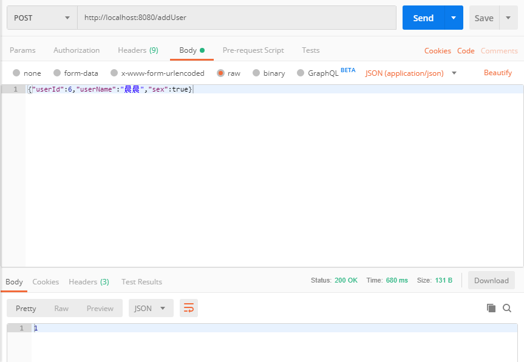
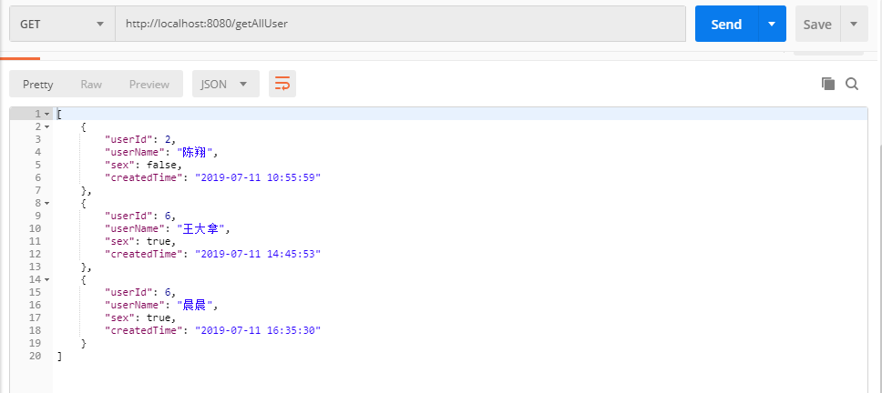
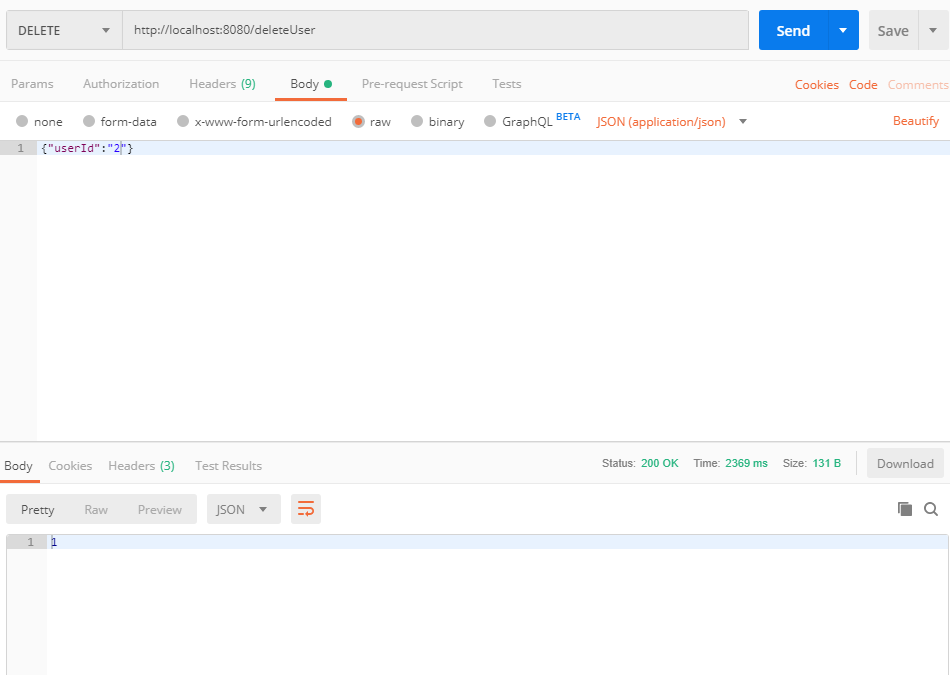

# spring-boot-practice

[原项目链接](https://github.com/hansonwang99/Spring-Boot-In-Action/)

### 项目搭建

新建Spring Boot工程

` pom.xml`中添加MyBatis和MySq依赖

```xml
<dependency>
            <groupId>org.mybatis.spring.boot</groupId>
            <artifactId>mybatis-spring-boot-starter</artifactId>
            <version>1.3.2</version>
        </dependency>
        <dependency>
            <groupId>mysql</groupId>
            <artifactId>mysql-connector-java</artifactId>
            <version>5.1.6</version>
</dependency>
```

配置`application.properties`

```properties
mybatis.type-aliases-package=com.helloworld.demo.entity
mybatis.mapper-locations=classpath:mapper/*.xml
mybatis.configuration.map-underscore-to-camel-case=true
spring.datasource.url=jdbc:mysql:///xxx?characterEncoding=UTF8
spring.datasource.driver-class-name=com.mysql.jdbc.Driver
spring.datasource.username=xxx
spring.datasource.password=xxx

```

### 建立实体类User

```java
public class User {
    private Long userId;
    private String userName;
    private Boolean sex;
    private String createdTime;
}
```

### Mybatis接口和映射

UserMapper.xml映射文件

```xml
<?xml version="1.0" encoding="UTF-8" ?>
<!DOCTYPE mapper PUBLIC "-//mybatis.org//DTD Mapper 3.0//EN" "http://mybatis.org/dtd/mybatis-3-mapper.dtd" >
<mapper namespace="com.helloworld.demo.mapper.UserMapper">

    <resultMap id="userMap" type="com.helloworld.demo.entity.User">
        <id property="userId" column="user_id" javaType="java.lang.Long"></id>
        <result property="userName" column="user_name" javaType="java.lang.String"></result>
        <result property="sex" column="sex" javaType="java.lang.Boolean"></result>
        <result property="createdTime" column="created_time" javaType="java.lang.String"></result>
    </resultMap>

    <select id="getAllUser" resultMap="userMap">
        select * from user_test
    </select>

    <insert id="addUser" parameterType="com.helloworld.demo.entity.User">
        insert into user_test ( user_id, user_name, sex, created_time ) values ( #{userId}, #{userName}, #{sex}, #{createdTime} )
    </insert>

    <delete id="deleteUser" parameterType="com.helloworld.demo.entity.User">
        delete from user_test where user_id = #{userId}
    </delete>

</mapper>
```

UserMapper.java

```java
public interface UserMapper {
    List<User> getAllUser();
    int addUser(User user);
    int deleteUser(User user);
}
```

### Service实现Controller

UserServiceImpl.java

```java
@Service
@Primary
public class UserServiceImpl implements UserService {
    @Autowired
    private UserMapper userMapper;
    @Override
    public int addUser(User user) {
        SimpleDateFormat form = new SimpleDateFormat("yyyy-MM-dd HH:mm:ss");
        user.setCreatedTime(form.format(new Date()));
        return userMapper.addUser(user);
    }

    @Override
    public int deleteUser(User user) {
        return userMapper.deleteUser(user);
    }

    @Override
    public List<User> getAllUser() {
        return userMapper.getAllUser();
    }
}

```

这里自动装配userMapper的时候不知道为什么编译器一直报错，但是运行却没问题。

### Controller实现

```java
@RestController
public class UserController {
    @Autowired
    private UserService userService;
    @RequestMapping(value = "/getAllUser",method = RequestMethod.GET)
    public List<User> getAllUser(){
        return userService.getAllUser();
    }
    @RequestMapping(value = "/addUser",method = RequestMethod.POST)
    public int addUser(@RequestBody User user){
        System.out.println(user.toString());
        return userService.addUser(user);
    }
    @RequestMapping(value = "/deleteUser",method = RequestMethod.DELETE)
    public  int deleteUser(@RequestBody User user){
        System.out.println(user.toString());
        return userService.deleteUser(user);
    }
}

```

### 运行类

```java
@SpringBootApplication
@MapperScan("com.helloworld.demo")
public class DemoApplication {

    public static void main(String[] args) {
        SpringApplication.run(DemoApplication.class, args);
    }

}
```

这里需要使用@MapperScan("com.helloworld.demo")，之前没注意，运行的时候一直报错，读取不到bean，百度后发现是没使用扫描注解。

### 运行测试

刚开始测试的时候，第一次使用PostMan这个软件，有点不会用。一直使用的是下图的方式，一直报RequestBody的参数错误。


后来仔细看了原博主的测试图片，需要发送JSON格式的数据。下图是正确的方式。



调用`getAllUser`方法，查找。



调用`deleteUser`方法，删除。



